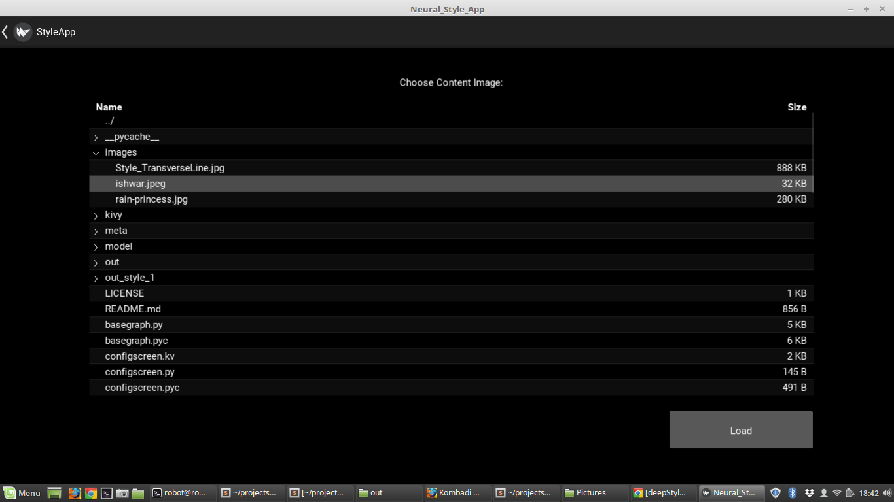
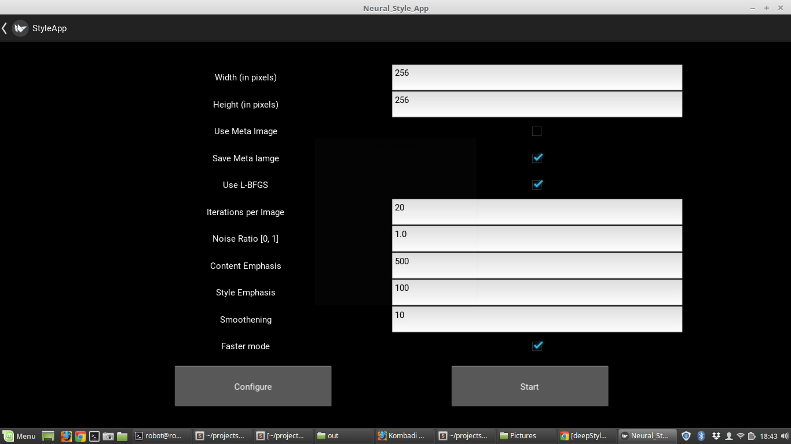
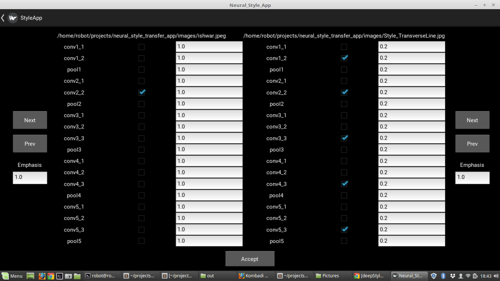
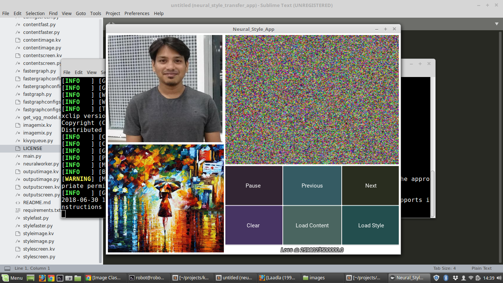
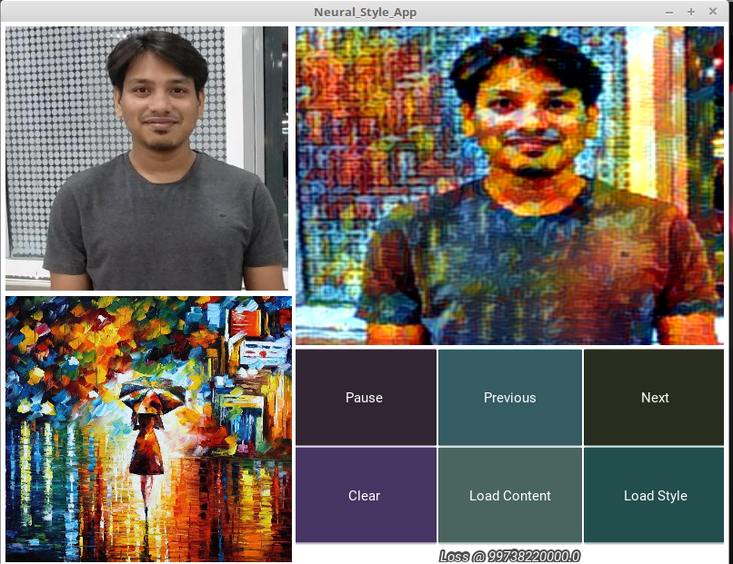
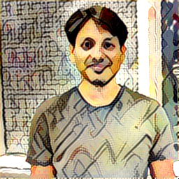
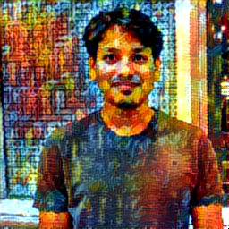

# neural_style_transfer_app 
Style Transfer App Using Neural Network

[Post Link](https://medium.com/@ishwarsawale/neural-style-transfer-app-7d5feb3df422)

## Installation 
Kivy
  - Clone Kivy from Github
  - cd in kivy
  - git checkout -b 1.10.1
  - Install following Dependencies
  ```bash
  sudo apt-get install libsdl2-ttf-dev libsdl2-image-dev libsdl2-gfx-dev libsdl2-dev libsdl2-mixer-dev
sudo apt-get install libgl1-mesa-dev libgles2-mesa-dev zlib1g-dev python-pip
sudo apt-get install libgstreamer-plugins-base1.0-dev libgstreamer-plugins-bad1.0-dev libgstreamer-plugins-good1.0-dev
sudo apt-get install -t jessie-backports libgles2-mesa libgl1-mesa-dri libgl1-mesa-glx libdrm2
sudo apt-get install -t jessie-backports libwayland-egl1-mesa
  ```
  - python setup.py build_ext --inplace -f

Machine Learning
  - Python 3.6
  - Install requirment.txt


## How to Start App
- Run script get_vgg_model.sh [This will download two VGG models]
- Copy Content Image & Style Image in images directory
- Run main.py

## App Demo

First Screen


Select Content Fil3


Select Style File


Click on train & Select Params


Configure which Layers to Select


Initial Run Generates Noise


After Some Time (Like after 25 Epoches)


## Some Samples
 


License
----

MIT


**Free Software, Hell Yeah!**
